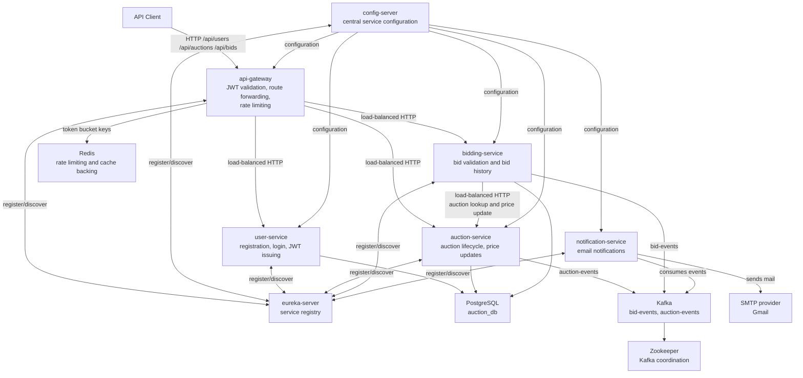

# Spring Boot Microservices Auction System

This project is a Dockerized Spring Boot microservices system for an auction and bidding platform. It separates user authentication, auction management, bid placement, notifications, service discovery, configuration, and gateway concerns into independent services that communicate through HTTP, Eureka service discovery, Kafka events, Redis-backed rate limiting/caching, and PostgreSQL persistence.

## Services

| Service | Port | Purpose |
| --- | ---: | --- |
| `api-gateway` | `9090` | Public entry point. Routes API calls, validates JWTs, forwards user claims, and applies Redis-backed rate limits. |
| `config-server` | `8888` | Central configuration server using local native config files from `classpath:/configs/`. |
| `eureka-server` | `8761` | Service registry used by Spring Cloud clients and load-balanced service names. |
| `user-service` | `8081` | Registers users, authenticates credentials, hashes passwords, and issues JWTs. |
| `auction-service` | `8082` | Owns auction records, current bid state, auction closing, and auction-ended Kafka events. |
| `bidding-service` | `8083` | Validates and stores bids, calls auction-service to update price, and publishes bid events. |
| `notification-service` | `8084` | Consumes Kafka events and sends email notifications. |

## Architecture

The diagram intentionally shows services and infrastructure only, not class names.

## Main Runtime Flows

### Registration and Login

1. The client calls `api-gateway` on `/api/users/register` or `/api/users/login`.
2. `api-gateway` treats those two paths as public and forwards them to `user-service`.
3. `user-service` validates the request, stores users in PostgreSQL, hashes passwords with BCrypt, and returns a JWT on login.
4. Later secured requests include `Authorization: Bearer <token>`.

### Secured Request Routing

1. The client calls the gateway with a bearer token.
2. `api-gateway` validates the token with the shared `JWT_SECRET`.
3. The gateway extracts `userId` and `role` claims and forwards them as `X-User-Id` and `X-User-Role`.
4. Gateway routes use Eureka logical service IDs such as `USER-SERVICE`, `AUCTION-SERVICE`, and `BIDDING-SERVICE`.

### Auction Creation and Closing

1. Authenticated clients create auctions through `/api/auctions`.
2. `auction-service` uses `X-User-Id` as the seller id, saves the auction in PostgreSQL, and initializes it as `ACTIVE`.
3. A scheduled job checks expired active auctions.
4. Expired auctions are marked `CLOSED`, and `auction-service` publishes an `auction-events` Kafka message.
5. `notification-service` consumes the event and sends email notifications.

### Bid Placement

1. Authenticated clients place bids through `/api/bids`.
2. `bidding-service` reads the bidder id from `X-User-Id`.
3. It calls `auction-service` through OpenFeign to fetch auction state.
4. It rejects bids for closed/expired auctions, seller self-bidding, and amounts not higher than the current bid.
5. It saves the bid in PostgreSQL, asks `auction-service` to update the current auction price, and publishes a `bid-events` Kafka message.
6. `notification-service` consumes the event and emails the seller.

## Configuration And Infrastructure

The root `docker-compose.yml` starts PostgreSQL, Redis, Zookeeper, Kafka, Eureka, Config Server, Gateway, and all domain services. Environment variables are expected from `.env`, including:

| Variable | Used by |
| --- | --- |
| `DB_USER`, `DB_PASSWORD` | PostgreSQL-backed services |
| `JWT_SECRET`, `JWT_EXPIRY` | `user-service` and `api-gateway` |
| `MAIL_USERNAME`, `MAIL_PASSWORD` | `notification-service` |

Each application has a local `application.yml` that imports config from `config-server`; the effective service settings live under `config-server/src/main/resources/configs/`.

## Service Documentation

Each service has its own detailed README:

- [api-gateway](api-gateway/README.md)
- [config-server](config-server/README.md)
- [eureka-server](eureka-server/README.md)
- [user-service](user-service/README.md)
- [auction-service](auction-service/README.md)
- [bidding-service](bidding-service/README.md)
- [notification-service](notification-service/README.md)
